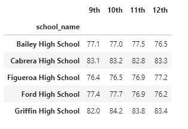

# pandas-school

<cite>Photo by [Taylor Wilcox](https://unsplash.com/@taypaigey?utm_source=unsplash&utm_medium=referral&utm_content=creditCopyText) on [Unsplash](https://unsplash.com/s/photos/school?utm_source=unsplash&utm_medium=referral&utm_content=creditCopyText)</cite>

 

## Overview  

 
The dataset and notebook investigate the performance of reading and math scores of high school students within one school system during one testing cycle.  

 

## Technologies    
*  Python
*  Pandas

 

## Data Source  
Dataset generated by Trilogy Education Services. Origins beyond this is unknown. 

 

## Setup and Installation  
1. Environment needs the following:  
    *  Python 3.6+  
    *  Pandas  
1. Activate your environment
1. Clone the repo to your local machine
1. Start Jupyter Notebook within the environment from the repo
1. Run `school_analysis.ipynb` 

 

## Analysis  

1.  The school system is made up of 15 secondary education campuses with 3,9170.  The total budget of the school is $24,649,428.
1.  The entire system has 79% math passing score and 82% reading passing score.  
1.  Students with a 70% or higher math average include 75% of all the students.   Students with a 70% or higher reading average include 86% of all the students.  
1.  Due to the nature of this data, there are many summaries and critiques of the data.  Here is an exampe of one summary dataframe that shows the performance of the 15 schools.  

<figure>

  
<figcaption>Table 1 - In the image above, I could format the columns more but right now I am using my default styling that works well for 90% of this analysis. 
</figcaption>
</figure>

5. One point of attention about Table 1:   `Overall % Passing Rate` is calculated with a simple average of two values.  This is not representative of the true meaning. 
  

    **`Stats Warning`**:  Maybe warning, this is pretty simple -  The individual calculation of students passing represents the proportion of students with over a 70% score.  This calculation is very representable with our thoughts.  The calculation of percent passing of two subjects should not be the simple average of two previous averages in this case.  Saying that simple average represents the proportion of students passing is not correct.    

    This simple average by definition must calculate between the two inputs but the actual proportion of students passing could be lower than the lower of the two inputs.  To actually find the proportion of students who have **both passed the two subjects** then you must find the number of students who have passed both subjects together and exclude students that have only passed one of the subjects.  
    
    The column `Better Overall % Passing` represents the proportion of students who have passed both subjects.  Examples of the affect can be seen in the last two columns.  
<figure>

  
<figcaption>Table 2 -  Average Math Scores per Grade by School
</figcaption>
</figure>

6.  Table 2 shows a partial snapshot of the average passing both subjects by grade.  More could be analyzed by plotting some of this information.  For right now, the data is being shown in a univariate style but plotting different distinguishing features of each school against each other (bivariate analysis) would be the next step.  I am hesitant to go into much more detail in this analysis considering that the dataset doesn't not have multi-year records for students, nor non-aggregated test scores.  With a larger data set with more test scores, a program could be written to predict what the growth as a student `should` be and warning systems for when students are `beginning` to become off-track could be created.  

<figure>

  
<figcaption>Table 3 -  Average Reading Scores per Grade by School
</figcaption>
</figure>

7.  Similar to the previous table, Table 3 shows reading scores.  Student scores in reading were typically better than students scores in math.  I do not know if these scores represent the students taking the same exam or if it was different exams and these are just the final scores.  It would also be interesting to see what type of standardizing could be done on the data such that using a common exam could determine if there is any grade inflation based on what school the students attend.  This would be a truly interesting project since it has many real-world implications and could lead to hypotheses of why the school might or might not want to do this and does this bias have a positive or negative effect in any scenarios.  
<figure>

  
<figcaption>Table 4 -  Average Scores per Expenditures per Student
</figcaption>
</figure>

8.  I don't have much to say about Table 4 except that there is a correlation between spending and scores.  This table shows a decrease in performance based on increased spending.  This could be for several reasons:  
      *  maybe I did something wrong so I should double check these calculations by getting a subset of data (I don't think I am wrong)  
      *  lower performing schools may be given more money to have a lower teacher-to-student ratio or other academic supports like tutoring programs
      *  a non-academic factor is influencing funding like school meal programs and in-school medical programs that support students in lower income neighborhoods.  

    >This last reason for score differences between schools is a very complicated and time consuming analysis if the goal is to incorporate how those externalities affect school performance and the recommendations that should be made.  In an essence, if the schools have significant external factors at play then making recommendations based on other schools becomes very biased because the populations are truly different and comparisons begin to break down based on the significance of these factors.  If these factors are deemed significant then looking at year-over-year type data for each school would be better but really a design of experiment (DOE) would be the best way of getting valuable information.   
<figure>

  
<figcaption>Table 5 -  Average Scores per School Size
</figcaption>
</figure>

9.  Table 5 shows that large schools are noticeably different than schools with populations under 2,000 students.  The large school category should be broken down into more sub-units and analyzed or a bivariate analysis should be applied.  This type of analysis and this dataset might be a very good case for using a tool like Tableau if the dataset is small.  If the dataset is large then it is better to use python and pandas and if it is a really large dataset then using SQL or Spark might even be better.  
<figure>

  
<figcaption>Table 6 -  Average Scores by School Type
</figcaption>
</figure>

10.  Table 6 shows significant differences between Charter and District schools.  I would probably investigate potential reason why this would occur before moving on to a more detailed analysis.  For this cursory analysis, is adequate for identifying the potential path forward.  Considering the subject is school performance, a significant amount of background information would be needed to make recommendations and again those type of studies would typically be done by developing a school metrics program that develops specific ways of measuring valuable data that could not be solely obtained through single data point measurement.  

 

> **`On a side note:`**  
I have always enjoyed analysis of education data because of it's complexity, the necessity to consider external factors, and need to identify data that specifically targets the question that you are wanting to answer.  I don't think it is likely to arrive at consequential, school-specific recommendations by broadly looking at general data.  If conclusions are made and are impactful from this type of analysis then most likely stakeholders had avoided using any basic monitoring type program that would identify issues - I would call this type of analyis a `low hanging fruit`, `easy reward`, or `high return, low risk` type analysis since it would only be identifying what should have been already tracked and monitored as high level metrics or verification that high level planning had been implemented.    
